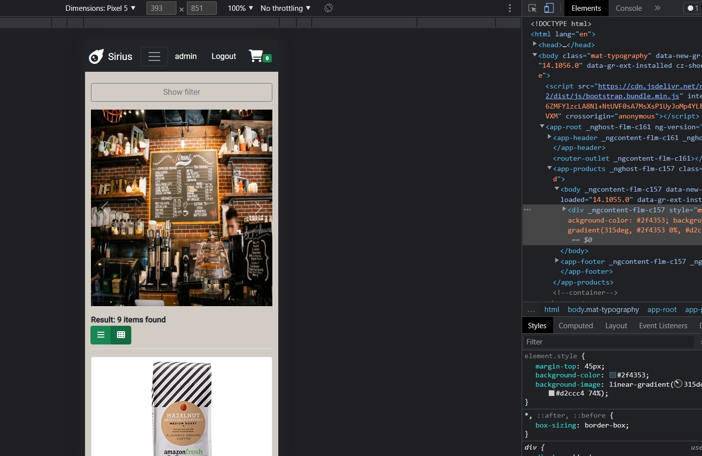

<h1 align="center">Angular E-commerce Web Application (With CRUD)</h1>

<h3 align="center">Languages and Tools:</h3>

   </a>    

## Contents:
 - [Categories](#categories)
      - [Video](#video)
      - [About](#about-project)
      - [Used Packages And Modules](#used-packages-and-modules)
      - [Getting Started](#getting-started)
      - [Prerequisites](#prerequisites)

## Video
<strong>Click the picture below for watching video on youtube. You will able see how website is working.</strong>

(I forgot to mention in video that the website also responsive because of bootstrap template)

<strong>Click the picture below for watching video on youtube. You will able see how i made website.</strong>
COMING SOON

## About Project
Angular e-commerce web application with CRUD operations for bootcamp final assignment.

## Used Packages And Modules

- AppRouting Module
- HttpClient Module
- FormsModule
- ReactiveForms Module
- Font Awesome
- Bootstrap 5
- Angular Metarials Modules
- Ngx Toastr Module
- AuthGuard
- Interceptor Modules

## Getting Started

:rocket: Run `npm i or npm install` to install all packages then install start fake server json api with `npm install -g json-server`then start server `json-server --watch db.json` then finally for compling and starting page `ng serve --o`.

## Prerequisites
- JSON Api
- npm
- Angular 13
- Bootstrap 5
- VS Code
- Angular Metarial